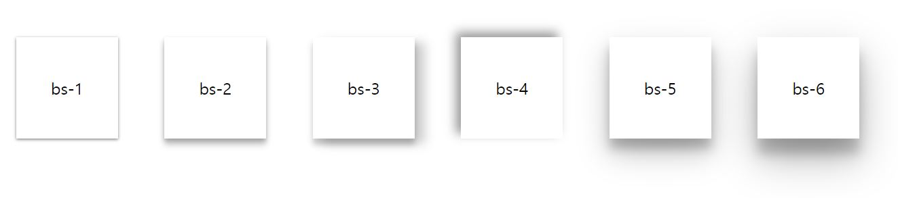
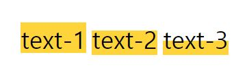

# box-shadow



그림자 효과를 주는 box-shadow는 `h-shadow`,`v-shadow`,`blur`,`spread`,`color` 속성을 넣어준다.   
순서대로 수평 방향, 수직 방향, 흐린 정도, 그림자의 크기, 색상이다.    
보통 `spread` 속성은 제외하고 사용하는 경우가 많은 것 같다.

```css
box-shadow: 0 1px 3px rgba(0, 0, 0, 0.5)
```
   
--- 
   
   
요즘 웹 사이트에서 텍스트에 형광펜 효과를 준 것을 자주 볼 수 있었는데, 이 효과 역시 box-shadow를 이용한다.   


box-shadow에서 `inset` 속성을 추가하여 안쪽 그림자 효과를 주어 표현할 수 있다.

```css
box-shadow: inset 0 -24px 0 #ffd43b
```
