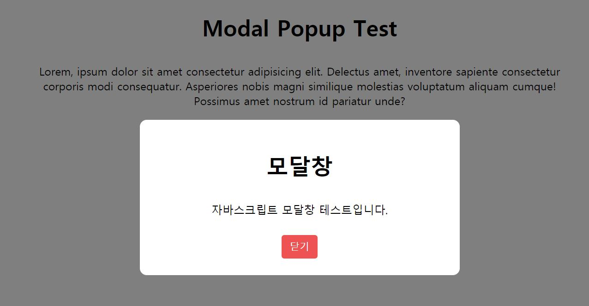

# JavaScript Modal Popup



버튼을 클릭하여 모달 창 띄우기

### Review

modal 부분을 html에 추가해준 후 `display:none`으로 설정  
open 버튼과 close 버튼을 `querySelector`로 가져와서 `onclick`으로 `display` 값을 바꾸어 준다.

```javascript
open.onclick = () => {
  modal.style.display = "flex";
};

close.onclick = () => {
  modal.style.display = "none";
};
}
```
