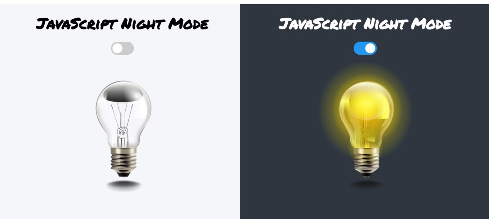

# JavaScript Night Mode



슬라이더 스위치를 클릭하면 **Night Mode**로 전환

- 사용한 font : `google font` - Permanent Marker

### Review

전체를 감싸는 div태그에 스위치 클릭 시 changeMode 함수가 실행되도록 한다. 

```javascript
function changeMode() {
  container.className === "night"
    ? (container.className = "day") & (bulb.src = "images/off.png")
    : (container.className = "night") & (bulb.src = "images/on.png");
}
```   
class명이 `day`이면 클릭 시 class명을 night로 바꿔주고 전구가 켜진 이미지로 src 전환, css로 배경색 변경   
class명이 `night`이면 클릭 시 class명을 day로 바꿔주고 전구가 꺼진 이미지로 src 전환
